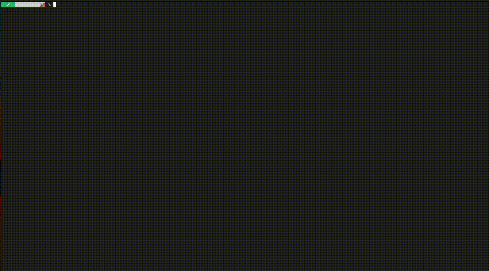

<div align="center">

[](#)
[](#)
[](#)


<!--  -->

</div>

&nbsp;

<h1 align="center"> 
  🐚 minishell
</h1>

<h3 align="center"> 
  a small, expandable and animated shell to learn
</h3>

<div align="center">

</div>

&nbsp;

## Key features
- Command parsing and tokenization
- Execution via fork/execve
- Builtins: cd, echo, pwd, export, unset, env, exit
- Pipes, redirections and heredoc (`|`, `>`, `>>`, `<`, `<<`)
- Logic operators (`||`, `&&`)
- Basic signal handling for interactive mode
- Optional small prompt animation (`-a`)


## Requirements

- Linux (POSIX-compatible)
- gcc or clang
- make

## Quick start — build & run

Clone and Built
```bash
git clone https://github.com/RoboFB/minishell.git
cd minishell
make
```

Run
```bash
./minishell        # add --animation or -a to enable it
```


## Project layout (short)

```
minishell/
├── include/     # headers
├── libft/       # own library
├── obj/         # binary files (builded)
└── src          # implementation
│   ├── animation/
│   ├── execution/
│   ├── parsing/
│   ├── utils/
│   └── main.c
├── Makefile
├── minishell    # executable (builded)
└── README.md  
```

## Allowed functions (summary)

The project was completed under a constrained set of allowed functions. Commonly used calls include:

- malloc, free
- write, open, read, close, perror
- dup, dup2, pipe
- fork, execve, wait, waitpid
- opendir/readdir/closedir
- readline
- signal/sigaction


## Acknowledgments

- [42 Heilbronn](https://www.42heilbronn.de/de/)
- [GNU Bash manual](https://www.gnu.org/software/bash/manual/bash.html)
- [ Shell Command Language](https://pubs.opengroup.org/onlinepubs/9699919799/utilities/V3_chap02.html)
- [Pret Paring core dump video](https://youtu.be/0c8b7YfsBKs?si=AitdZJebN1rQwKYC)
