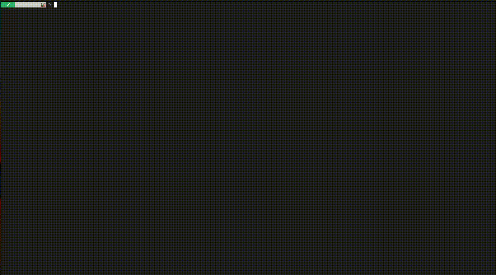

<div align="center">

[](#)
[](#)
[](#)


<!--  -->

</div>

&nbsp;

<h1 align="center">
  🐚 minishell
</h1>

<h3 align="center">
  a small, expandable and animated shell to learn
</h3>

<div align="center">

</div>

&nbsp;


## Wall of Text
Minishell is the first group project of the [42 Heilbronn](https://www.42heilbronn.de/de/) core curriculum.
The main goal of this project was to recreate a small shell matching some of the core behaviors of Bash, while relying only on a handful of C functions and system calls.
Typically the project will be split into two big parts: parsing (Moritz) and execution (Robin). One challenge was in structuring the code to enable us to easily make fixes and extend funtionality while complying with the 42 Norm — for example: the 25 line limit for functions.
During our deep dive, we discovered many edge cases and odd Bash-behaviors, such as ambiguous redirects. We used these to infer how to structure the program in general, so as to create situations where those behaviors would not have to be hard-coded against what we were doing.
Overall, it was a great learning experience. Big thanks to my partner, Moritz Diepgen.


## Key features
- Command parsing and tokenization
- Execution via fork/execve
- Builtins: cd, echo, pwd, export, unset, env, exit
- Pipes, redirections and heredoc (`|`, `>`, `>>`, `<`, `<<`)
- Logic operators (`||`, `&&`)
- Basic signal handling for interactive mode
- Optional small prompt animation (`-a`)


## Allowed functions (summary)
The project was completed under a constrained set of allowed outside functions. Commonly used calls include:

- malloc, free
- write, open, read, close, perror
- dup, dup2, pipe
- fork, execve, wait, waitpid
- opendir/readdir/closedir
- readline
- signal/sigaction


## Requirements
- Linux (POSIX-compatible)
- gcc or clang
- make


## Quick start — build & run
### Clone and Built
```bash
git clone https://github.com/RoboFB/minishell.git
cd minishell
make
```
If the compiling fails, check `CC` and `CFLAGS` in both `Makefile`. Try to use `CC=gcc` or `CC=clang`.

### Run
```bash
./minishell        # add --animation or -a to enable animations
```


## Project layout (short)
```
minishell/
├── include/     # headers
├── libft/       # own library
├── obj/         # binary files
└── src          # implementation
│   ├── animation/
│   ├── execution/
│   ├── parsing/
│   ├── utils/
│   └── main.c
├── Makefile
├── minishell    # executable
└── README.md
```


## Acknowledgments
- [42 Heilbronn](https://www.42heilbronn.de/de/)
- [GNU Bash manual](https://www.gnu.org/software/bash/manual/bash.html)
- [Shell Command Language](https://pubs.opengroup.org/onlinepubs/9699919799/utilities/V3_chap02.html)
- [Pratt Parsing core dump video](https://youtu.be/0c8b7YfsBKs?si=AitdZJebN1rQwKYC)
